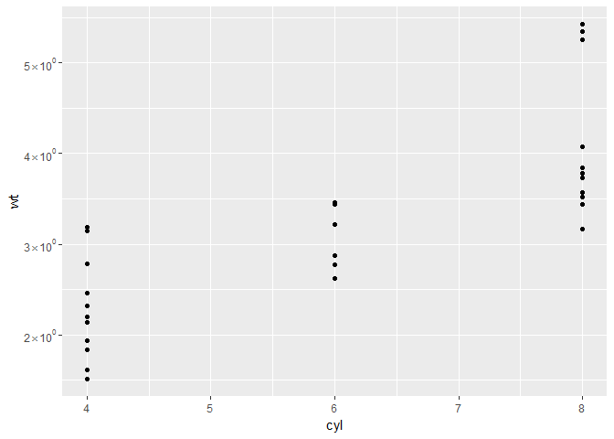
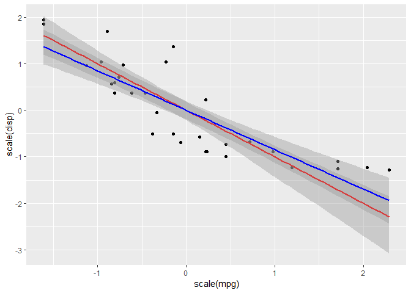

COEF: Collection Of Esoteric Functions
======================================

Installation
------------

    library(devtools)
    install_github("Russel88/COEF")

adonis_OmegaSq
------

Calculate (partial) Omega-squared (effect-size calculation) for PERMANOVA

    library(COEF)

    adonis_OmegaSq(adonisOutput)

rcurve
------

Rarefaction curve (theoretical and fast) from a phyloseq object. Output ready for plotting in ggplot2

    library(COEF)

    rcurve(physeq, subsample = c(1e3 * 1:50))

read\_elisa
-----------

Seamless loading of data from ELISA plate reader, including
descriptions.

It will load excel files, and can automatically locate the 96 well plate
as long as there is only data from 1 plate in 1 excel file.

The function will also load descriptions of what is in each well of the
96 well plate. These descriptions should be in the same excel file, but
in seperate sheets. See the [example
data](https://raw.githubusercontent.com/Russel88/COEF/master/ExampleData/test.xlsx)
for how to set it up.

The input is the path for where the excel file is located, e.g.
paths="C:/Users/mystuff/file.xlsx"), or if several excel files should be
loaded at the same time write the path for the folder containing the
excel files (it should contain nothing else than excel files): e.g.
paths="C:/Users/mystuff/".

See the example data
[here](https://raw.githubusercontent.com/Russel88/COEF/master/ExampleData/test.xlsx),
which can be loaded like this:

    data <- read_elisa(paths = "test.xlsx", descriptions = 2)

The following error might arise:

    Error in read_fun(path = path, sheet = sheet, limits = limits, shim = shim,  : 
      Evaluation error: zip file 'X.xlsx' cannot be opened.'

This is because 'X.xlsx' is in the path argument but does not exist.

fancy\_scientific
-----------------

Numeric to fancy scientific notation. By [Brian
Diggs](https://groups.google.com/forum/#!topic/ggplot2/a_xhMoQyxZ4)

How to use it:

    library(ggplot2)
    library(COEF)
    data(mtcars)
    ggplot(mtcars, (aes(cyl, wt))) +
      geom_point()+
      scale_y_continuous(labels = fancy_scientific)

tls
---

Total Least Squares for ggplot stat\_smooth and geom\_smooth with
bootstrapped confidence intervals

Remember that x and y has to be on the same scale!

How to use it:

    library(ggplot2)
    library(COEF)
    data(mtcars)
    ggplot(mtcars, (aes(scale(mpg), scale(disp)))) +
      geom_point() +
      geom_smooth(method = "tls", colour = "red") +
      geom_smooth(method = "lm", colour = "blue")

p2bayes
-------

Estimate the maximum possible Bayes factor from a p-value

Bayes factor is here the ratio of the likelihood probability of the
alternative versus the null hypothesis.

    library(COEF)

    p2bayes(0.05)

    ## [1] 2.456023

prune_by_group
--------------

Prune taxa from a phyloseq object such that taxa are present in at least 
proportion P in at least one "Group" of samples.

    library(COEF)

    prune_by_group(physeq, "Group", P = 0.5)
